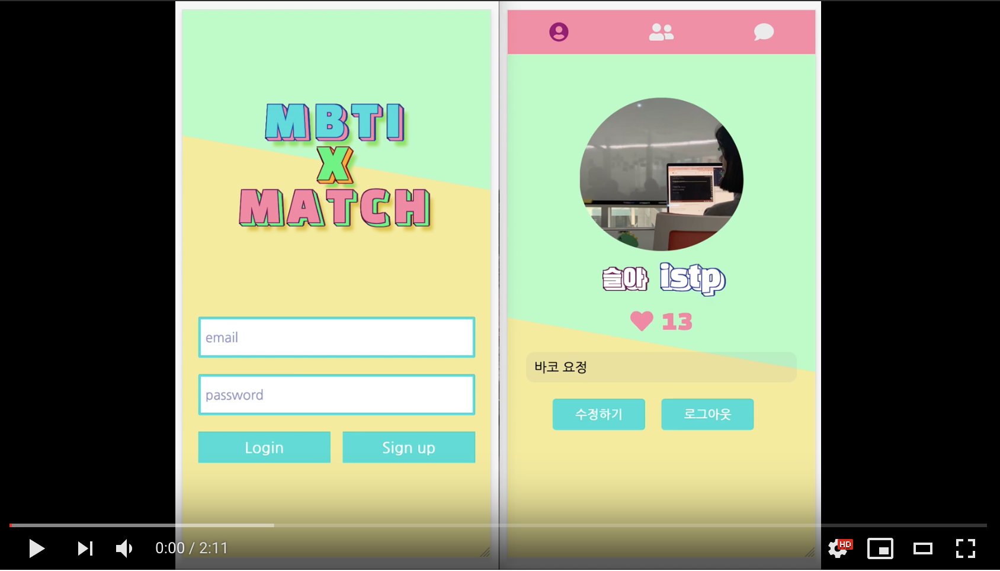

# mbti-match

[](https://youtu.be/ApJpejiBE9I)

소개팅 모바일 웹 어플리케이션입니다. 
유저 리스트에서 사용자가 상대방을 좋아요 눌렀을 경우 [mbti]([https://en.wikipedia.org/wiki/Myers%E2%80%93Briggs_Type_Indicator](https://en.wikipedia.org/wiki/Myers–Briggs_Type_Indicator)) 적합성을 결과로 알려주고 socket.io를 이용하여 채팅 하실 수 있습니다.

## Installation

#### Client

```
git clone https://github.com/yami03/mbti-match-client.git
cd mbti-match-client
npm install
npm run dev
```

#### Server

```
git clone https://github.com/yami03/mbti-match-server.git
cd mbti-match-server
npm install
npm run dev
```

로컬에서 실행시 /.env 파일이 필요합니다.

```
NODE_ENV=development
DATABASE_URI
AWS_ACCESSKEYID
AWS_SECRETACCESSKEY
```

* DATABASE_URI: Mongodb와 연결할 connection string 
*  AWS_ACCESSKEYID: 액세스할 수 있는 권한이 있는지 여부를 확인하는 Amazon Web Services(AWS)의 엑세스 키 ID
* AWS_SECRETACCESSKEY: 액세스할 수 있는 권한이 있는지 여부를 확인하는 Amazon Web Services(AWS)의 시크릿 키

## Features

* Passport.js를 이용한 local login
* Session을 이용하여 login 유지
* 회원가입시 s3를 이용하여 프로필 사진 업로드
* 상대방의 프로필을 보고 좋아요 혹은 싫어요로 체크
* 서로 좋아요를 클릭했을 경우 매칭되어 mbit 적합성을 백분율로 확인 가능
* 좋아요나 싫어요를 클릭한 회원은 더이상 회원목록에서 보이지 않음
* 매칭되었을 시 채팅 가능

## Skills

#### Client-Side

* ES2015+
* React
* Redux
* Socket.io-Client
* Sass
* Axios API

#### Server-Side

* Node.js
* Express
* ES2015+
* MySQL
* Passport.js
* socket.io
* AWS S3

## Deployment

* **Server**

  AWS Elastic Kubernetes Services

* **Client**

  AWS CloudFront

[Vanilla Coding](https://github.com/vanilla-coding)

